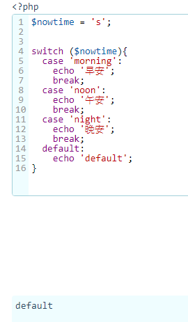
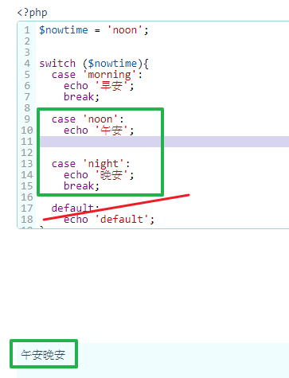
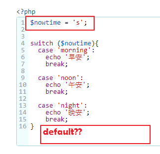

# PHP_基礎/註解/變數/陣列/條件判斷/

- PHP基礎
  - PHP與Html混寫
  - PHP分號;指令結束符
  - 表達式
- 註解
- 變數/變量
  - $開頭
- array陣列
- 條件判斷if else
  - if
  - if else
  - if elseif else
  - switch case(類似 if else)
- 迴圈
  - for
  - foreach
  - while
  - do while


---
## PHP基礎

Server端腳本語言

**在Server解析PHP成Html,在發Html給瀏覽器**

### PHP與Html混寫

```
<?php
 這是php標記符號,所有php code都寫在這裡
?>
<h1>但這裡的html code會正常顯示</h1>
```

### PHP分號;指令結束符

**每行結束都要;**

**但唯獨大瓜號{}後不用加**

### 表達式
只要這行code/代碼能出一個值(12,布林 等)就算表達式

## 註解

```
<?php
  //單行...
  #單行...
  /*
  ...
  多行
  多行
  多行
  */

?>
```


## 變數/變量

**$開頭**

以字母開頭,不能以數字開頭

$a1 ( O )

$1s  ( X )

$a1 = "string"  **附值**

---

## array陣列

PHP中儲存多個值時便需要用到陣列。

陣列可使用兩種，Key為數值(一般)，與指定Key


## 條件判斷if else

常見的判斷式為以下 

- if
- if else
- if elseif else
- switch case(類似 if else)

網路範例 :

### if
### if else

### if elseif else


----

### switch

switch中每個case需要配一個break來跳出，如果沒加上break則程式會繼續往下跑直到break出去，或者default時結束。default代表case條件都沒有符合時，最後會執行的結果，相當於if esleif中的最後一個else。


以上switch例子相當於以下if elseif else，程式邏輯跟運行結果是相同的。


**switch case需要注意**

**1.case沒有break**
**2.沒有default**


## 迴圈

重複執行程式時，就可以用迴圈幫我們重覆無聊的動作

- for：重複執行程式到指定次數
- foreach：陣列中巡覽每個索引key & value
- while：條件成立則進行迴圈
- do while：先執行一次，之厚條件成立則進行迴圈


### for(初始值; 判斷條件; 增減值)

```
<?php
$y = 0;
//for(初始值; 條件值; 遞增值)

for ($i = 0; $i < 5; $i++) {
    $y = $y + $i;
}
print_r($y);
 
//結果:10
```

上面迴圈意思是$i從0開始計數，每執行$i的值+1，當$i的值不符合條件$i < 5時停止迴圈。
**$i++:**代表返回$i後+1。
**++$i**:代表+1後返回$i。

每次執行結果如下:

| 變數\次數 | 1    | 2    | 3    | 4    | 5    |
| --------- | ---- | ---- | ---- | ---- | ---- |
| $i        | 0    | 1    | 2    | 3    | 4    |
| $y        | 0    | 1    | 3    | 6    | 10   |

```
<?php
$y = 0;
for ($i = 10; $i > 0; $i = $i - 2) {
    $y = $y + $i;
}
print_r($y);
 
//結果:30
```

| 變數\次數 | 1    | 2    | 3    | 4    | 5    |
| --------- | ---- | ---- | ---- | ---- | ---- |
| $i        | 10   | 8    | 6    | 4    | 2    |
| $y        | 10   | 18   | 24   | 28   | 30   |


### foreach(array as key => value)

利用foreach輸出陣列值

```
<?php
$food = array('早上' => '漢堡', '中午' => '水餃', '下午' => '蛋糕', '晚上' => '鍋貼', '其他時間' => '拉麵');
 
//foreach(陣列 as 陣列索引值 => 陣列值)

foreach ($food as $nowTime => $eatFood) {
    echo $nowTime . '吃' . $eatFood;
    echo '<br>';
}
 
/*
早上吃漢堡
中午吃水餃
下午吃蛋糕
晚上吃鍋貼
其他時間吃拉麵
 */
```

### while

while迴圈運用和for迴圈差不多，記得要讓條件值達成(true)，反則會進入無窮迴圈。

```
<?php
$i = 0;
$y = 0;
 
//while(條件值)
while ($i < 5) {
    $i++;
    $y = $y + $i;
}
 
echo $y;
 
//結果:15
```

**while要小心，$ｉ++ 時是在判斷條件後　索以ｉ可以到第 5次，也就是ｉ= 5**

| 變數 \ 次數 | 1    | 2    | 3    | 4    | 5    |
| ----------- | ---- | ---- | ---- | ---- | ---- |
| $i          | 1    | 2    | 3    | 4    | 5    |
| $y          | 1    | 3    | 6    | 10   | 15   |

```
<?php
$i = 0;
$y = 0;
 
while ($i < 0) {
    $i++;
    $y = $y + $i;
}
echo $y;
 
//結果:0
```

條件成立迴圈內程式不執行，故$y為當初預設值0。

### do while

do while跟while唯一不同之處在於，**do while會先執行一次程式再來判斷條件值。**
我們拿剛才while當作範例。

```
<?php
$i = 0;
$y = 0;
 
do {
    $i++;
    $y = $y + $i;
} while ($i < 0);
 
echo $y;
 
//結果:1
```

| 變數 \ 次數 | 1    |
| ----------- | ---- |
| $i          | 1    |
| $y          | 1    |

----

### 自我實測







