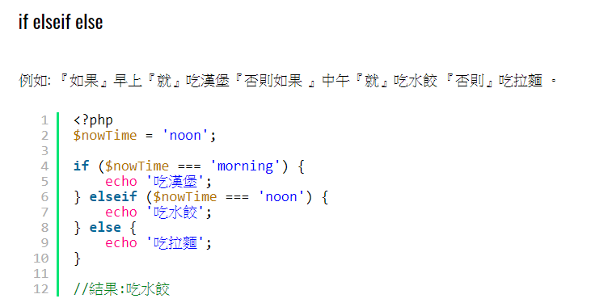

# PHP_註解/變數/陣列/條件判斷/

## PHP_array陣列

PHP中儲存多個值時便需要用到陣列。

陣列可使用兩種，Key為數值(一般)，與指定Key

## PHP_條件判斷if else

常見的判斷式為以下 

- if
- if else
- if elseif else
- switch case(類似 if else)

網路範例 :

### if
### if else

### if elseif else

----

### switch

switch中每個case需要配一個break來跳出，如果沒加上break則程式會繼續往下跑直到break出去，或者default時結束。default代表case條件都沒有符合時，最後會執行的結果，相當於if esleif中的最後一個else。

以上switch例子相當於以下if elseif else，程式邏輯跟運行結果是相同的。

**switch case需要注意**

**1.case沒有break**
**2.沒有default**

