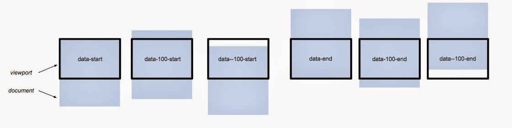
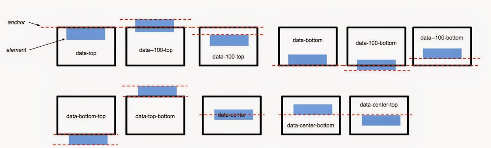

# 前端skrollr

[<https://coderwall.com/p/we0ymg/skrollr-parallax-scrolling>] 如何使用 skrollr 做出簡易的 Parallax Scrolling 網頁

[<http://lala0812.logdown.com/posts/240837-skrollr-easily-implement-css3-html5-parallax-scrolling>]使用Skrollr.js實作視差滾動-(一)入門篇

----

----

### 如何使用 skrollr 做出簡易的 Parallax Scrolling 網頁

前一陣子大家非常瘋 Parallax Scrolling 網頁，主要是利用人們瀏覽網頁時最習慣的動作「滾動」來做一些特效，讓使用者透過簡易的滾動就能瀏覽完整個網頁。

**就是使用滑鼠中的滾輪作動畫特效**

Parallax Scrolling 中文翻成視差滾動，wiki 上的定義上說明這是電腦圖學中一種特別的滑動特效技巧，原理是把背景圖片的移動速度放慢，讓前景圖片移動較快，因而在2D畫面上產生多層次的佈景深度。

例如有明顯前後景之分的是覺特效[<http://www.pixages.fun/>]

---

---

### 語法使用

```
<div data-0="background-color:rgb(0,0,255);transform[bounce]:rotate(0deg);" 
     data-500="background-color:rgb(255,0,0);transform[bounce]:rotate(360deg);">WOOOT</div>
```

解析這段語法函義：

- `data-0`：Skrollr使用data來定義影格，0代表SkrollrTop的值：畫面中有兩個影格分別是`data-0`與`data-500`，而裡面的值，則分別用CSS來定義他的過渡效果
- `ackground-color:rgb(0,0,255)`：Skrollr只能使用 hsl 跟 rgba 的色彩編碼(但你可以使用插件[skrollr-colors](https://github.com/FezVrasta/skrollr-colors))
- `transform[bounce]`：
  - Skrollr的實作原理是將CSS3的transform從原本的秒數，變成SkrollTop的PX數，應此開發人員另外提供了擴充語法來支援CSS3的非線性函數
  - Skrollr會處理CSS3的Prefix問題

---

---

### Keyframe用法

什麼是Keyfame：學Flash的就想像他是關鍵影格，想像影片的播放Bar中的秒數在視差滾動實作中，概念被轉化成了ScrollBAR及物件的offset.

Skrollr提供下列兩個Keyframe用法。

#### absolute mode (document mode)：將**文本(document)**在視窗中的位置，也就是Scroll Top當作觸發影格的關鍵

定義：

##### `DATA-[OFFSET]-[ANCHOR]`

- offset：定義偏移值，型別為整數值，可以是負值，不指定時為`0`：這裡的偏移值概念上是以文本為基準，我們可以理解為取得視窗相對於文本的偏移位置(參考下圖)，也就是Skroll top
- anchor：定義參考點(錨點)，有`Start`或`End`兩個參數，預設值為Start.：定義了偏移值的參考位罝是文本的開頭還是結尾
- 這兩個參數至少要有一個

讓我們看以下，下列分別定義了哪些關鍵影格

- `data-0` = `data-start` = `data-0-start`: scrolltop = 0
- `data-100` = `data-100-start`: scrolltop = 100
- `data--100` = `data--100-start`: scrolltop = -100
- `data-end` = `data-0-end`: 當文本到達結尾的時後
- `data-100-end`: 當文本到到結尾的前100px
- `data--100-end`: 當文本到到結尾後，超過100px(開發者說，不管你用不用得到XD)


#### relative mode(viewport mode)：將**Dom物件(element)**在視窗中的位置，當作觸發影格的關鍵

##### `DATA-[OFFSET]-(VIEWPORT-ANCHOR)-[ELEMENT-ANCHOR]`

- offset：定義偏移值，型別為整數值，可以是負值，不指定時為`0`：用來定義物件與視窗的偏移值(兩個物件的相對位置)
- viewport-anchor： 定義視窗的參考位置，可以是 `top`(預設值)，`center`，`bottom`，指的是視窗的上緣，下緣，以及中間
- element-anchor：定義物件的參考位置 可以是 `top`(預設值)，`center`，`bottom`，指的是物件的上緣，下緣，以及中間

讓我們看以下，下列分別定義了哪些關鍵影格

- `data-top` = `data-0-top` = `data-top-top` = `data-0-top-top`: 當視窗的上緣跟的物件上緣重疊的時後
- `data-100-top` = `data-100-top-top`: 當視窗的上緣跟物件的上緣重疊後，又超過了100px
- `data--100-top` = `data--100-top-top`: 當視窗的上緣跟物件的上緣重疊後，重疊前的100px
- `data-top-bottom`= `data-0-top-bottom`: 當視窗的上緣，跟物件的下緣重疊的時後(這時你是看不到物件的，但可以作為物件從畫面上方進場前的準備)
- `data-center-center` = `data-0-center-center`: When the element is at the center of the viewport.：當視窗的中間跟物件的中間重疊的時後(在使用者的眼前，畫面的中間)
- `data-bottom-center` = `data-0-bottom-center`: 當視窗的底部，與物件的中間重疊的時後(物件準備退場)


-----

----

### 容易犯的錯誤請特別注意

撰寫 CSS 轉場變化時要特別注意，每一個階段的 CSS 樣式一定要一致，舉個例子來說，當某個階段的 CSS 樣式有 `opacity: 0;</code> 及 -webkit-filter: blur(0px);</code>，其他階段的 CSS 樣式也一定要有 opacity: ;</code> 及 -webkit-filter: blur(px);</code>，否則會得到非預期的結果。`

這樣是錯的寫法（在 data-2400 少寫了 opacity 的樣式）：

```
<div data-2100="opacity: 1;-webkit-filter: blur(0px);" data-2400="-webkit-filter: blur(5px);">
    
</div>
```

正確的寫法（data-2100 有寫到 opacity, -webkit-filter，data-2400 就要寫到 opacity, -webkit-filter）：

```
<div data-2100="opacity: 1;-webkit-filter: blur(0px);" data-2400="opacity: 0;-webkit-filter: blur(5px);">
    
</div>
```





