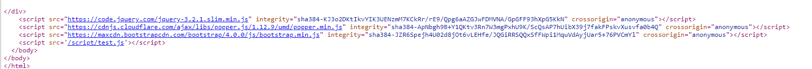

# 容易忘記_如何引用js/css

## CSS

引用在header, 使用link作引用 , link為 href="..."

```
<!DOCTYPE html>
  <head>
    // - CSS檔位置 or bootstrap.css">
    <link rel="stylesheet" href="../../CSS/style.css">
  </head>
```


## Js

引用在Html最後, 用script作引用, script為 src="..."

```
  </body>
  <script src="../../JS/index.js"></script>
  <script src="https://code.jquery.com/jquery-3.2.1.slim.min.js"></script>
</html>
```



